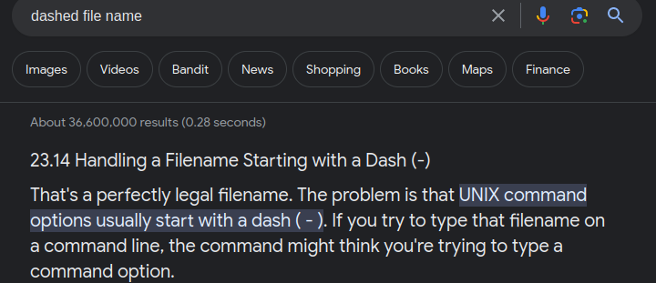
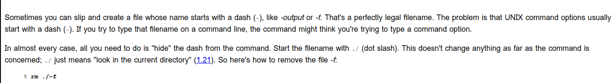
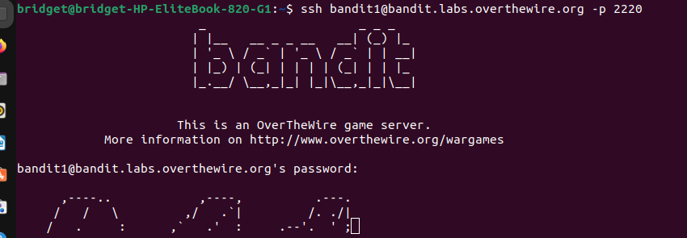
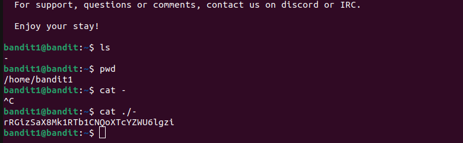

# BANDIT LEVEL 1

## Goal

--Password for the next level, level2 ,is stored in a file called -.\
--The file is located in the home directory.

### Commands to solve this level

ls , cd , cat , file , du , find

#### Helpful reading materials

<http://tldp.org/LDP/abs/html/special-chars.html>\
Google search dashed file name

##### LEVEL 1 SSH LOGIN SYNTAX

1.Username-bandit1\

2.Password-the one we obtained in level 0\
        -NH2SXQwcBdpmTEzi3bvBHMM9H66vVXjL\
3.Domain name bandit.labs.overthewire.org\

4.Port-2220\

**Syntax**\
ssh username@domain name -p port\
password -NH2SXQwcBdpmTEzi3bvBHMM9H66vVXjL

**Level2 password**\
rRGizSaX8Mk1RTb1CNQoXTcYZWU6lgzi
