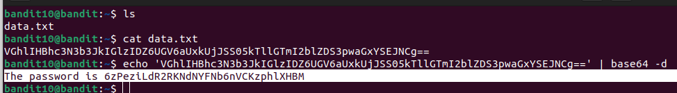

# BANDIT LEVEL 10

## Level goal

The password for the next level is stored in the file data.txt, which contains base64 encoded data\

### Commands to use

grep, sort, uniq, strings, base64, tr, tar, gzip, bzip2, xxd

#### SSH LOGIN DETAILS

Username- bandit10

Hostname- bandit.labs.overthewire.org

Port- 2220

Password-\
G7w8LIi6J3kTb8A7j9LgrywtEUlyyp6s

The content of the file **data.txt** happens to be encoded in base64

I knew it was base64 encoded because it has been mentioned from the level goal.

However to identify base 64 encoding ,you check the presence of the last *2 equal signs*
"VGhlIHBhc3N3b3JkIGlzIDZ6UGV6aUxkUjJSS05kTllGTmI2blZDS3pwaGxYSEJNCg=="

If you would like to understand more about base64 checkout this helpful reading material
<https://en.wikipedia.org/wiki/Base64>

I need to decode the  encoded_string

Here is the syntax\
**$echo encoded_string | base64 -d**

##### Level 11 password

6zPeziLdR2RKNdNYFNb6nVCKzphlXHBM
