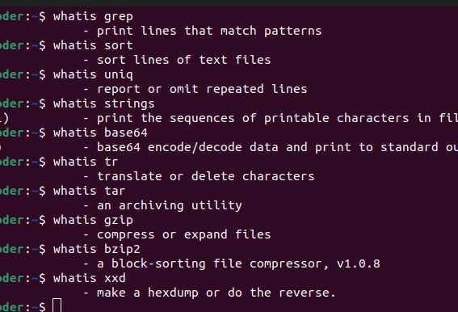
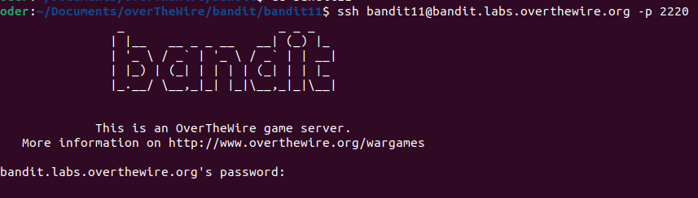
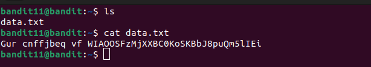
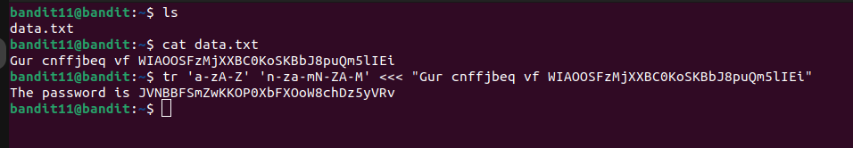
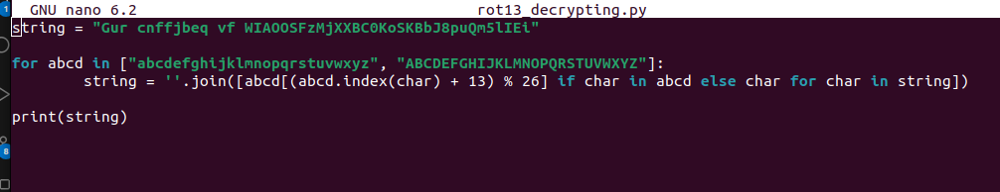
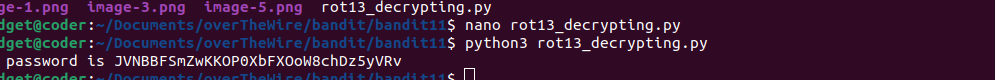
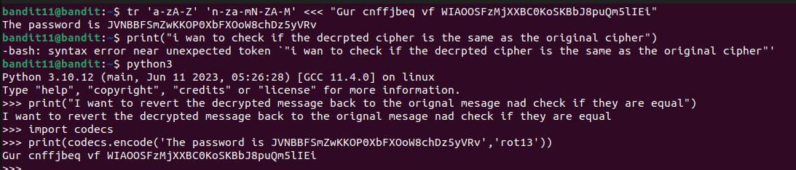
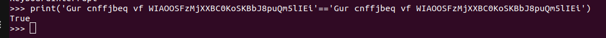

# BANDIT LEVEL 11

## LEVEL GOAL

The password for the next level is stored in the file data.txt, where all lowercase (a-z) and uppercase (A-Z) letters have been rotated by 13 positions

### Commands to use

grep, sort, uniq, strings, base64, tr, tar, gzip, bzip2, xxd

#### SSH LOGIN

Username- bandit11

Host- bandit.labs.overthewire.org

Port- 2220

Password-\
6zPeziLdR2RKNdNYFNb6nVCKzphlXHBM

After logging in,i found the file data.txt and displayed its contents.Indeed as the level goal has specified the contents seemed to be rotated using ROT13

I used the reading material provided to understand what ROT13 entails and how to decrypt

Boom.I found a way to decrypt ROT13 cipher.\
I will use the **tr command**

To checkout the reading material on ROT13,here is the link
<https://en.wikipedia.org/wiki/ROT13>

##### Level 12 Password

JVNBBFSmZwKKOP0XbFXOoW8chDz5yVRv

####### ANOTHER METHOD FOR SOLVING THIS LEVEL

After reading the reading material ,i found that I can use a script to decipher the rot13 cipher

I created a python script and named it rot13_decrypting.py\

After executing the python scipt,I get the password for level 12\

**FURTHER PRACTICE**\
I went an extra mile to revert back  the decrypted cipher to the original cipher.This has helped me practice rot13 encrypting and decrypting  skills further.

