# BANDIT 12

## LEVEL GOAL

The password for the next level is stored in the file data.txt, which is a hexdump of a file that has been repeatedly compressed. \
For this level it may be useful to create a directory under /tmp in which you can work using mkdir. For example: mkdir /tmp/myname123. Then copy the datafile using cp, and rename it using mv (read the manpages!)

### Commands to use in this level

grep, sort, uniq, strings, base64, tr, tar, gzip, bzip2, xxd, mkdir, cp, mv, file

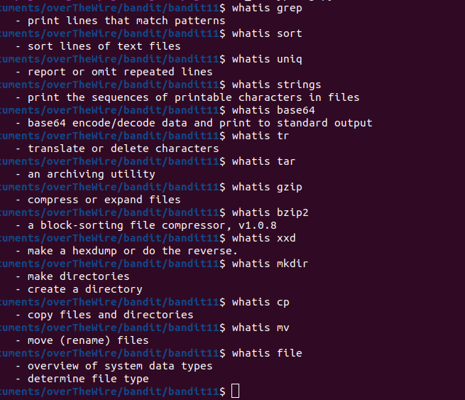

#### SSH LOGIN DETAILS

Username - bandit12
Hostname- bandit.labs.overthewire.org

Port- 2220

Password-\

From the level goal description ,I am supposed to create a directory at /tmp folder then copy data.txt file in that directory

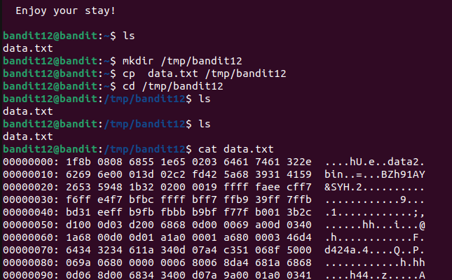

I will reverse the hexdump using the xxd command.

After,I check the file type and rename it to the file type extension

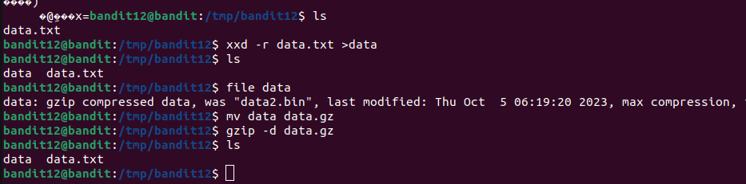
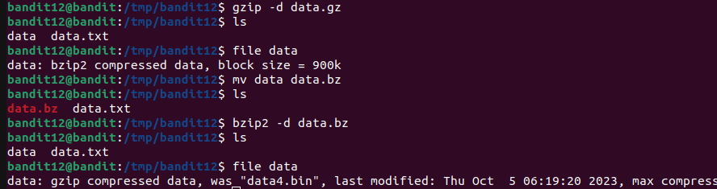
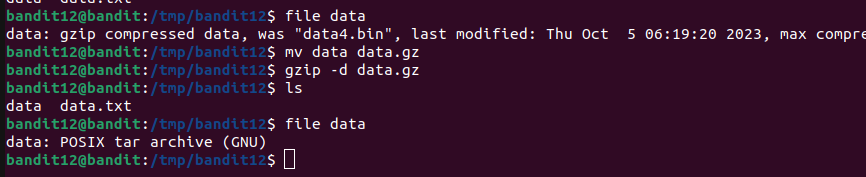
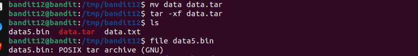

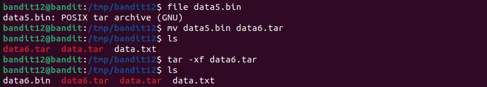
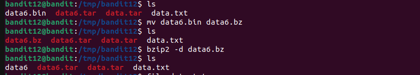
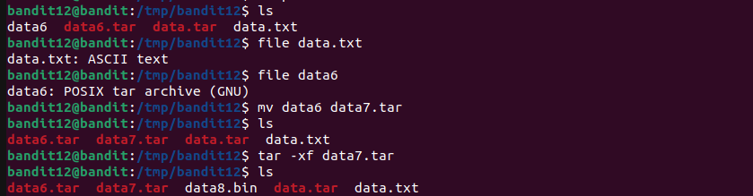
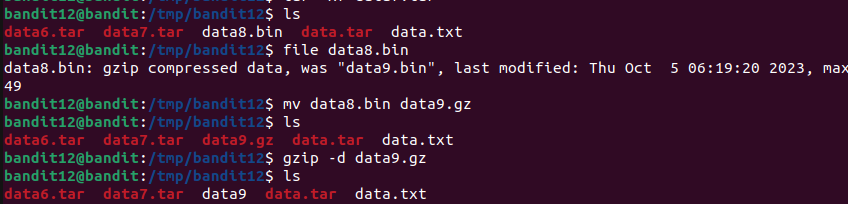
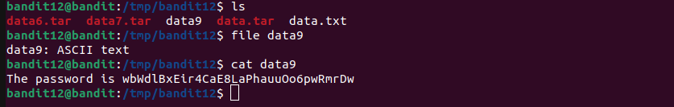

**Password**
wbWdlBxEir4CaE8LaPhauuOo6pwRmrDw
