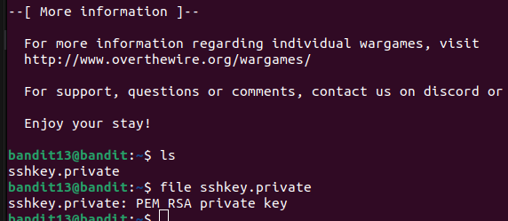

# LEVEL GOAL

The password for the next level is stored in /etc/bandit_pass/bandit14 and can only be read by user bandit14. For this level, you don’t get the next password, but you get a private SSH key that can be used to log into the next level. Note: localhost is a hostname that refers to the machine you are working on

## Commands you need

ssh, telnet, nc, openssl, s_client, nmap

**Helpful reading material**

* <https://help.ubuntu.com/community/SSH/OpenSSH/Keys>

## Solution

* Username -bandit13

* Hostname-bandit.labs.overthewire.org

* Port-2220

* Password- wbWdlBxEir4CaE8LaPhauuOo6pwRmrDw

Then we need to login to bandit 14 using the ssh key and retrieve the password

* Username-bandit14
* Hostname-local host
* Passsword-sshkey.private
* Port-2220

ssh bandit14@localhost -i sshkey -p 2220

At first i did not include the port and got an error while trying to login but i included the port and it was successful

After loggging in,in the level goal we are told the password is found in this path /etc/bandit_pass/bandit14

Found the flag

Password:\
fGrHPx402xGC7U7rXKDaxiWFTOiF0ENq
