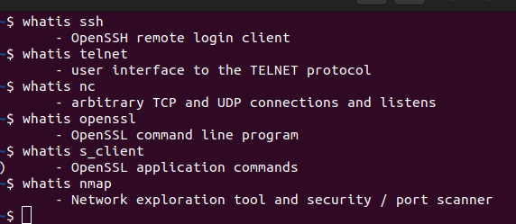
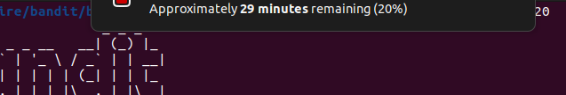
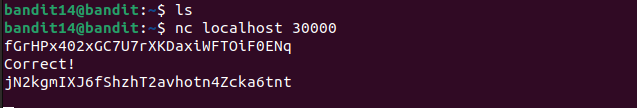

# BANDIT14

## LEVEL GOAL

The password for the next level can be retrieved by submitting the password of the current level to port 30000 on localhost.

## Commands you need

ssh, telnet, nc, openssl, s_client, nmap

**Helpful reading material**

* How the Internet works in 5 minutes (YouTube) (Not completely accurate, but good enough for beginners)<https://www.youtube.com/watch?v=7_LPdttKXPc>
* IP Addresses<https://computer.howstuffworks.com/web-server5.htm>
* IP Address on Wikipedia<https://en.wikipedia.org/wiki/IP_address>
* Localhost on Wikipedia<https://en.wikipedia.org/wiki/Localhost>
* Ports<https://computer.howstuffworks.com/web-server8.htm>
* Port (computer networking) on Wikipedia<https://en.wikipedia.org/wiki/*Port_(computer_networking)>

## Solution

* Username -bandit14
* Hostname-bandit.labs.overthewire.org
* Port-2220
* Password- fGrHPx402xGC7U7rXKDaxiWFTOiF0ENq

I used 'nc'command to connect to localhost port 30000 and then I entered the current password whcih gave me the password for the next level

Bandit level 15 Password:\
jN2kgmIXJ6fShzhT2avhotn4Zcka6tnt
