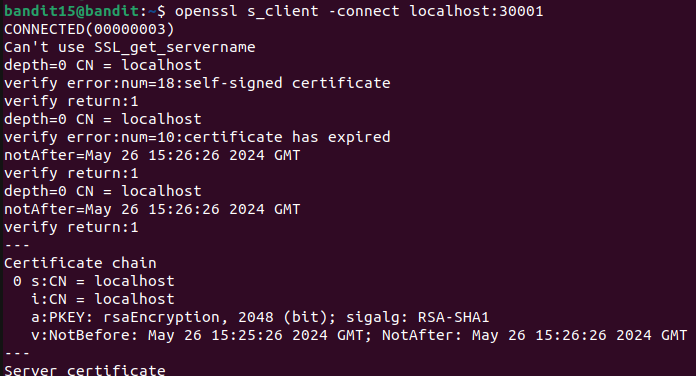
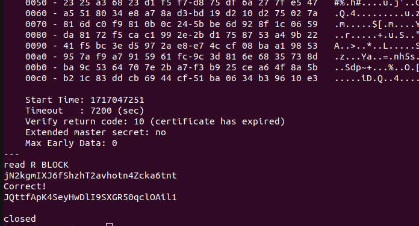

# BaANDIT LEVEL 15

## LEVEL GOAL

The password for the next level can be retrieved by submitting the password of the current level to port 30001 on localhost using SSL encryption.

Helpful note: Getting “HEARTBEATING” and “Read R BLOCK”? Use -ign_eof and read the “CONNECTED COMMANDS” section in the manpage. Next to ‘R’ and ‘Q’, the ‘B’ command also works in this version of that command…

**Commands you need**\
ssh, telnet, nc, openssl, s_client, nmap

**Helpful reading materials**\
    Secure Socket Layer/Transport Layer Security on Wikipedia\
    <https://en.wikipedia.org/wiki>\
    Transport_Layer_Security\
    OpenSSL Cookbook - Testing with OpenSSL\
    <https://www.feistyduck.com/library/openssl-cookbook/online/>

# SOLUTION

* Username- bandit15
* Hostname-bandit.labs.overthewire.org
* Port- 2220
* Password-jN2kgmIXJ6fShzhT2avhotn4Zcka6tnt

First you logging into bandit 15 using\
`ssh bandit15@bandit.labs.overthewire.org -p 2220`

**Bandit15 password**\
JQttfApK4SeyHwDlI9SXGR50qclOAil1
