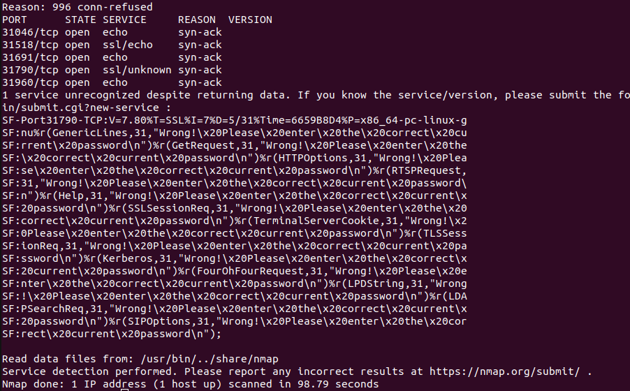

# BANDIT 16

## LEVEL GOAL

The credentials for the next level can be retrieved by submitting the password of the current level to a port on localhost in the range 31000 to 32000. First find out which of these ports have a server listening on them. Then find out which of those speak SSL and which don’t. There is only 1 server that will give the next credentials, the others will simply send back to you whatever you send to it.

**Commands to use**
ssh, telnet, nc, openssl, s_client, nmap

**Helpful reading material**\
   Port scanner on Wikipedia\
   <https://en.wikipedia.org/wiki/Port_scanner>

## SOLUTION

* Username -bandit16
* Hostname -bandit.labs.overthewire.org
* Port -2220
* Password -JQttfApK4SeyHwDlI9SXGR50qclOAil1

I will login using the credentials above
   `ssh bandit16@bandit.labs.overthewire.org -p 2220`

Then I perform an nmap scan of the specified ports range\

Based on the scan ,I found that port 31790 standsout since it returns a message "Enter the correct password"

From this ,i think this is the port  `31790` that we are going to focus on

Port 31790 service uses ssl encryption to mean we need to use openssl

After logging in using openssl,I submit bandit 16 password and get an RSA key as the password for bandit17

This is different from bandit 15 whereby after logging in using openssl,you get bandit16 password after submititing the correct bandit 15 password

Now we need to save the rsa key so as to log in to bandit level 17

I created a folder under the tmp folder because we have permissions
    `mkdir -p /tmp/banditPass`

Afterwards ,I created a file using nano called `key` and saved our rsa key in that file

To ensure that the key is correct I logged into bandit17 and I succesfully logged in into bandit17\
Hooray.

I have struggled with this bandit level especially testing the key but am happy am done with it.\
Dont forget like I did to include the port when logging into bandit17
