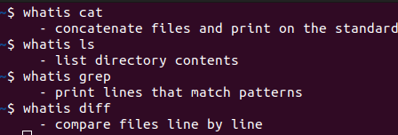
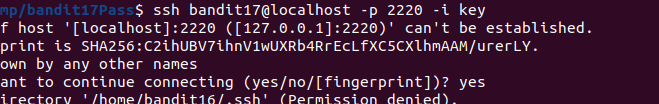
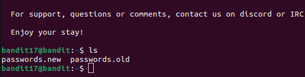
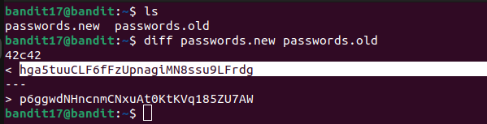

# Bandit 17

## LEVEL GOAL

There are 2 files in the homedirectory: passwords.old and passwords.new. The password for the next level is in passwords.new and is the only line that has been changed between passwords.old and passwords.new

NOTE: if you have solved this level and see ‘Byebye!’ when trying to log into bandit18, this is related to the next level, bandit19

**Commands you may need to solve this level**
cat, grep, ls, diff

# Solution

* Username -bandit17
* Hostname -localhost
* Port -2220
* Password- the private key obtained in bandit16

I logged in to bandit 17 using this command \
    `ssh bandit17@localhost -p 2220 -i key`

key is the private key I obtained in bandit 16.I saved it for later use

After logging in,I find the two files mentioned in the level goal.So now we need to compare the two files.I will use the diff command

## Bandit19 password
hga5tuuCLF6fFzUpnagiMN8ssu9LFrdg
