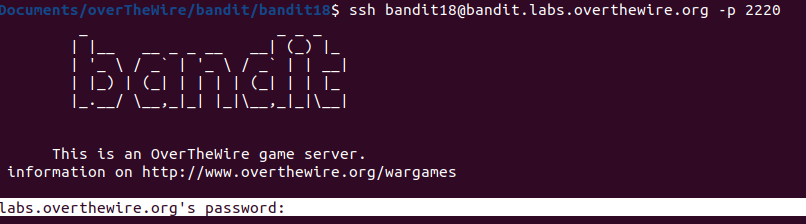

# Bandit18

## LEVEL GOAL

The password for the next level is stored in a file readme in the homedirectory. Unfortunately, someone has modified .bashrc to log you out when you log in with SSH.

**Commands you may need to solve this level**\
ssh, ls, cat

## Solution

* Username -bandit18
* Hostname -bandit.labs.overthewire.org
* Port -2220
* Password- hga5tuuCLF6fFzUpnagiMN8ssu9LFrdg

I logged in to bandit 18 but geuss what.\
I was logged out immediately.

I tried to find another way to log in into bandit18\
Suprisingly,in the level goal the location of the password has beeen mentioned.\
The location is in a file called readme in the home directory\
I tried to login again specifying the location of the file\

