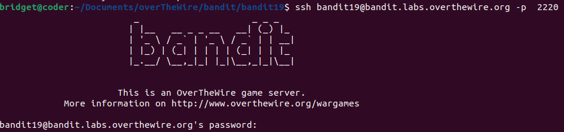
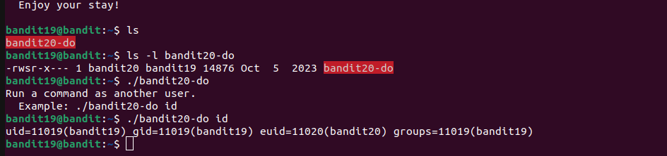
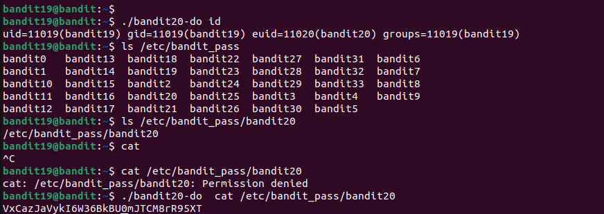

# Bandit 19

## LEVEL GOAL

To gain access to the next level, you should use the setuid binary in the homedirectory. Execute it without arguments to find out how to use it. The password for this level can be found in the usual place (/etc/bandit_pass), after you have used the setuid binary.\

**Helpful reading material**
setuid on Wikipedia\
<https://en.wikipedia.org/wiki/Setuid>

## Solution

* Username- bandit19
* Hostname- bandit.labs.overtgewire.org
* Port- 2220
* Password- awhqfNnAbc1naukrpqDYcF95h7HoMTrC

I logged in into bandit 19

I found one file `bandit-20 do`
This file is an ELF 32-bit LSB executable file\
Checkout this link to understand how to run an ELF 32-bit LSB executable file

Running the file with this command `./bandit-20 do`,I am given an example of the command to run\
After running the command, I find the SUID\

I then find the password for bandit20 from the folder we were told in the level goal section `/etc/bandit_pass`

**Bandit 20 password**\
VxCazJaVykI6W36BkBU0mJTCM8rR95XT
