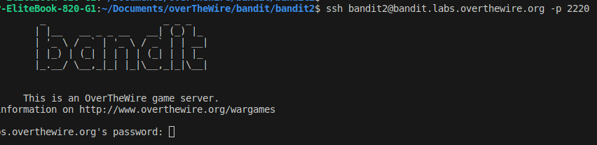

# BANDIT LEVEL 2

**GOAL**
-The password for the next level,*level 3* is stored in a file called spaces in this filename located in the home directory.

## Commands to use

-ls , cd , cat , file , du , find

### SSH LOGIN SYNTAX

Username -bandit2\
Hostname -bandit.labs.overthewire.org\
Port -2220\
Password-
NH2SXQwcBdpmTEzi3bvBHMM9H66vVXjL \

--After logging into bandit level 2 through ssh\
--I found the file specified in the challenge.\
--There are two ways to display contents of a file with spaced  name a shown below:\

\
**Level 3 password**
aBZ0W5EmUfAf7kHTQeOwd8bauFJ2lAiG
