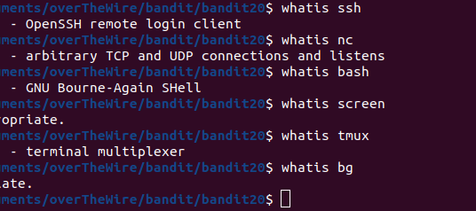
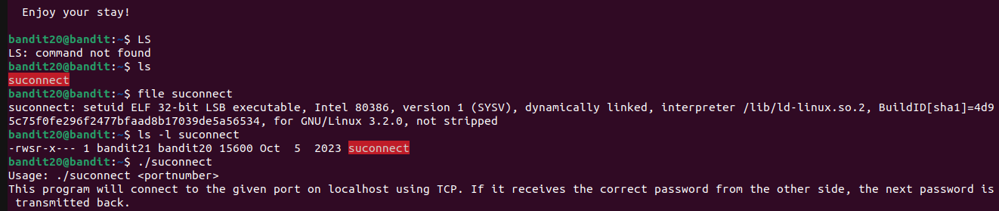
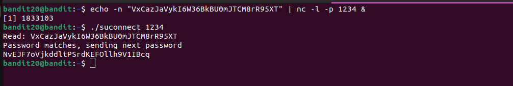

# BANDIT 20

## LEVEL GOAL

There is a setuid binary in the homedirectory that does the following: it makes a connection to localhost on the port you specify as a commandline argument. \
It then reads a line of text from the connection and compares it to the password in the previous level (bandit20). If the password is correct, it will transmit the password for the next level (bandit21).

NOTE: Try connecting to your own network daemon to see if it works as you think

**Commands to use**\

ssh, nc, cat, bash, screen, tmux, Unix ‘job control’ (bg, fg, jobs, &, CTRL-Z, …)

## Solution

* Username- bandit20
* Hostname- bandit.labs.overthewire.org
* Port- 2220
* Password- VxCazJaVykI6W36BkBU0mJTCM8rR95XT

I logged in to bandit 20 and found one file\
I do some analysis on the file and find it's the same type of file as that of bandit 19\
After running the file,a message about how to find the password is given

I sent bandit 20 password on port 1234 using a netcat listener\
The -n flag is to prevent newline characters in the input.\
I let the process run in the background with &.

I then ran the previous file and find bandit20 password

**Bandit21 password**\
NvEJF7oVjkddltPSrdKEFOllh9V1IBcq
