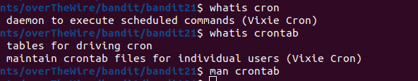
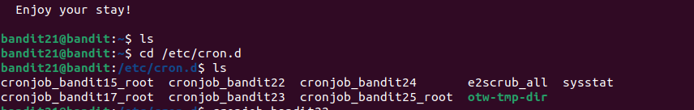

# BANDIT 21

## LEVEL GOAL

A program is running automatically at regular intervals from cron, the time-based job scheduler. Look in /etc/cron.d/ for the configuration and see what command is being executed.

**Commands to use**\
cron, crontab, crontab(5) (use “man 5 crontab” to access this)

## Solution
* Username- bandit21
* Hostname- bandit.labs.overthewire.org
* Port- 2220
* Password- NvEJF7oVjkddltPSrdKEFOllh9V1IBcq

Login to bandit22 with the usual command \
      `ssh bandit21@bandit.labs.overthewire.org -p 2220`
      
I navigate to the folder\
      `/ectc/cron.d`

I find there is a cron job for bandit 22\
I check it out and find the command to run to get the password\

There we go,I found the password to bandit level 22

**Bandit22 password**\
WdDozAdTM2z9DiFEQ2mGlwngMfj4EZff
