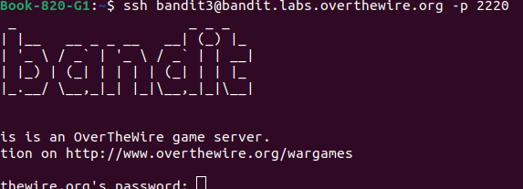
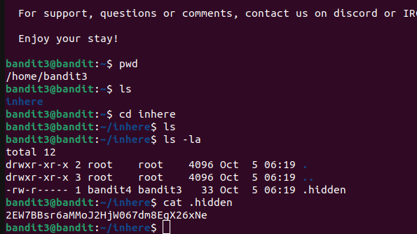

# BANDIT LEVEL 3

**GOAL**
The password for the next level,*LEVEL 4* is stored in a hidden file in the inhere directory.

## Commands to used

ls , cd , cat , file , du , find

### SSH SYNTAX LOGIN

Username -bandit3 \
Hostname -bandit.labs.overthewire.org\
Port -2220\
Password-aBZ0W5EmUfAf7kHTQeOwd8bauFJ2lAiG \

ssh username@hostname -p

LEVEL4 Password
