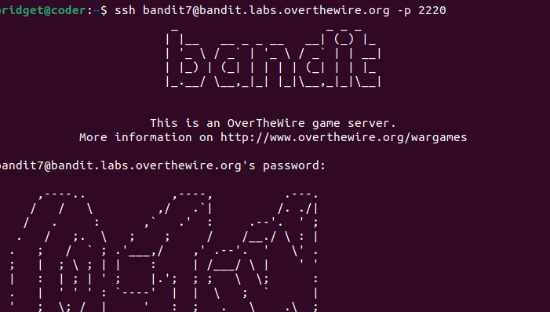
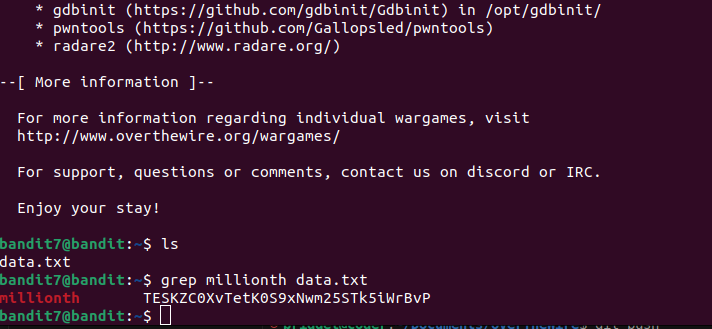
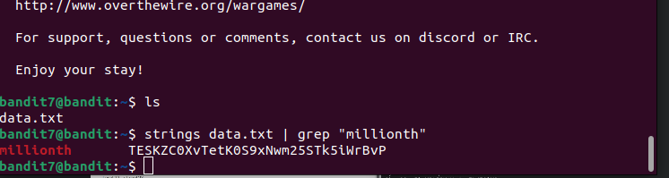

# BANDIT LEVEL 7

## GOAL

--The password for the next level is stored in the file **data.txt** next to the word millionth

### Commands to use

man, grep, sort, uniq, strings, base64, tr, tar, gzip, bzip2, xxd

#### SSH LOGIN DETAILS

->Username-bandit7

->Host- bandit.labs.overthewire.org

->Port-2220

->Password-
z7WtoNQU2XfjmMtWA8u5rN4vzqu4v99S

I used the grep command since from the level goal ,i was to find the password of level 8 next to the word millionth in the file caled data.txt\

You can also use the strings command to grep the content of the miilionth word

Level 8 password-\
TESKZC0XvTetK0S9xNwm25STk5iWrBvP
