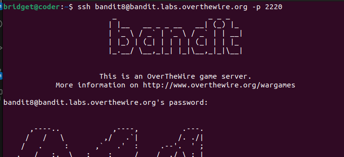

# BANDIT LEVEL 8

## GOAL

The password for the next level is stored in the file **data.txt** and is the only line of text that occurs only once

### Commands to use

grep, sort, uniq, strings, base64, tr, tar, gzip, bzip2, xxd

#### SSH LOGIN DETAILS

->Username-bandit8

->Host- bandit.labs.overthewire.org

->Port - 2220

-Password\
TESKZC0XvTetK0S9xNwm25STk5iWrBvP

I used the sort command and redirected the output to the uniq command which would count the number of times each word has been repeated.

I found one word that occurs only once and thats our password for level 9

**Level 9 password**\
EN632PlfYiZbn3PhVK3XOGSlNInNE00t
