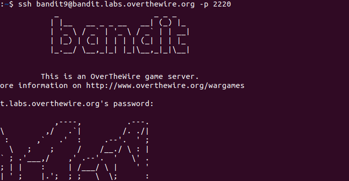
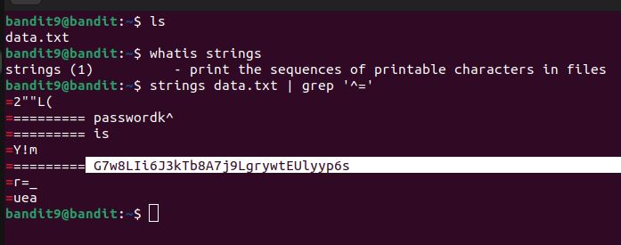
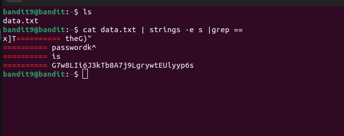

# BANDIT 9

## LEVEL GOAL

The password for the next level is stored in the file **data.txt** in one of the few human-readable strings, preceded by several ‘=’ characters.

### Commands to use

grep, sort, uniq, strings, base64, tr, tar, gzip, bzip2, xxd

#### SSH LOGIN DETAILS

-> Username- bandit9

-> Host- bandit.labs.overthewire.org

-> Port- 2220

-> Password-\
EN632PlfYiZbn3PhVK3XOGSlNInNE00t

##### LEVEL 10 PASSWORD

G7w8LIi6J3kTb8A7j9LgrywtEUlyyp6s

**ANOTHER WAY TO FIND LEVEL 10 PASSWORD**

This second solution reads the file named data.txt, extract human-readable strings from it, and then search for lines containing the == substring.
